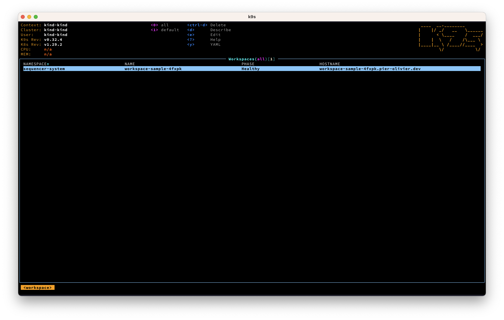

# Get Started

The easiest way to get started is to run a local cluster with [Kind](https://kind.sigs.k8s.io/). You'll also need

- A [Cloudflare](https://cloudflare.com) account with a domain fully configured there. All the features used on Cloudflare are available on the **free plan**.
- A [Docker](https://docker.com) account. A **free account** is also enough for this guide.

The steps that follows expects that you already have a Kubernetes cluster up and running and Sequencer is also installed on the cluster. It will also assume that it's all running inside the default namespace `sequencer-system`. If you did change it for another name, you'll have to replace the namespace with the one you chose.

## Setup credentials

You will need to use an API Token for both [Cloudflare](./docs/providers/cloudflare.md) and [Docker](./docs/providers/docker.md). The Docker integration will be used to upload the image. The Cloudflare integration will be in charge of creating a DNS entry and a Tunnel to the application so it can be publicly accessible.

Once you followed the steps in the two guide above, you'll be able to get aa basic application setup.

## Deploy your first workspace

Before you can deploy your first workspace, you'll need to gather the following:

- The secret's name and the key that points to the Cloudflare API Token
- The ZoneID and the AccountID for the domain you want to use on Cloudflare
- The secret's name for the Docker Hub credentials


```yaml
apiVersion: se.quencer.io/v1alpha1
kind: Workspace
metadata:
  labels:
    app.kubernetes.io/name: workspace
    app.kubernetes.io/instance: workspace-sample
    app.kubernetes.io/managed-by: sequencer
    app.kubernetes.io/created-by: sequencer
  generateName: workspace-sample-
  namespace: sequencer-system
spec:
  networking:
    cloudflare:
      secretKeyRef:
        name: cloudflare-api-token # Change this to your value if it's different
        key: apiKey # Change this to your value if it's different
      dns:
        zoneName: yourdomain.com # Change this to your value if it's different
        zoneId: abcd1234 # Change this to your value if it's different
      tunnel:
        connector: cloudflared
        accountId: abcd123455abcd # Change this to your value if it's different
        route:
          component: click-mania
          network: http
  components:
    - name: redis
      networks:
        - name: tcp
          port: 6379
          targetPort: 6379
      template:
        containers:
          - name: redis
            image: redis:latest
            ports: 
              - containerPort: 6379
    - name: mysql
      networks:
        - name: tcp
          port: 3306
          targetPort: 3306
      template:
        containers:
          - name: mysql
            image: mysql:latest
            env:
              - name: MYSQL_RANDOM_ROOT_PASSWORD
                value: "true"
              - name: MYSQL_PASSWORD
                value: whatever
              - name: MYSQL_USER
                value: potest
              - name: MYSQL_DATABASE
                value: mydb
            ports: 
              - containerPort: 3306
    - name: click-mania
      dependsOn:
        - componentName: mysql
          conditionType: Pod
          conditionStatus: Healthy
        - componentName: redis
          conditionType: Pod
          conditionStatus: Healthy
      template:
        containers:
          - name: click
            image: ${build::clickaroo}
            ports:
              - containerPort: 3000
            env:
              - name: DB_HOST
                value: ${components::mysql.networks.tcp}
              - name: REDIS_HOST
                value: ${components::redis.networks.tcp}
              - name: DB_NAME
                value: mydb
              - name: DB_USER
                value: potest
              - name: DB_PASSWORD
                value: whatever
            command:
              - /srv/aurora-test
              - start
      networks:
        - name: http
          port: 3000
          targetPort: 3000
      build:
        name: clickaroo
        dockerfile: Dockerfile
        containerRegistries:
          - url: yourdocker/repo # Change this to your value if it's different
            tags:
              - foo
              - bar
            credentials:
              authScheme: keyPair
              secretRef:
                name: dockerhub-credentials # Change this to your value if it's different
        importContent:
          - contentFrom:
              git:
                ref: main
                url: https://github.com/pier-oliviert/cookie-clicker.git
```

The best way to do this is to replace the commented fields with the fields you used, then save it to a file, let's say `myworkspace.yml` create the file with `kubectl`:

```sh
kubectl create -f myworkspace.yml
```

If you are a [K9s](https://k9scli.io/) user, you should track progress browsing the custom resources (`workspaces`, `components`, `builds`). At some point, if everything is set up properly, you should be able to see the workspace become `Healthy` with a `Host` you can access.



If you copy the Host value and paste it in your browser, you should see your demo app running!

