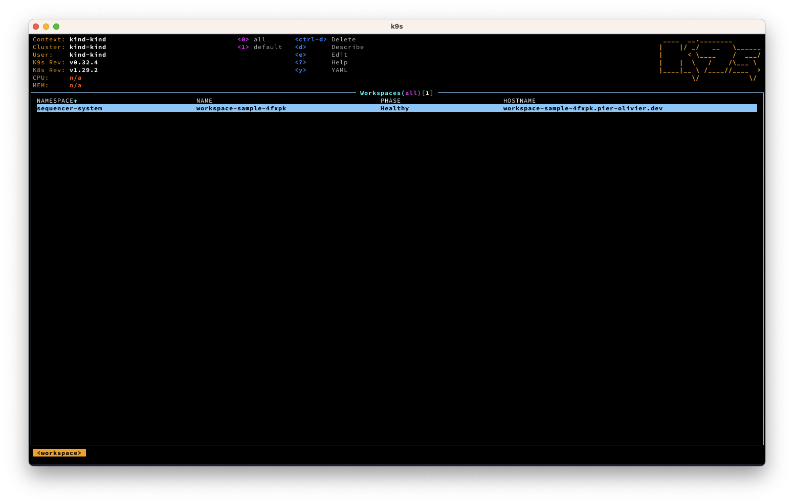

# What is Sequencer?
Sequencer is a Open Source Kubernetes [Operator](https://kubernetes.io/docs/concepts/extend-kubernetes/operator/) that manages previews of your production application. Users of PaaS like Heroku and Vercel are familiar with the concept of running ephemeral environments for testing and QA purposes. You can now to do the same, wherever your infrastructure lives. **You can go from zero to a fully deployed application all within your own Kubernetes cluster**.

Imagine you have an application that has a MySQL database and a Redis cache, you'd like each PR to have a preview application deployed, it doesn't have to have all the bell and whistles a production environment would have, but you'd like to have the application _behave_ like one.

You'd like to have the application deployed with the latest change from the branch you're working on too. You probably already have a Dockerfile that can build this for you. Here's the template you'd create, for this application:

```yaml
apiVersion: github.com/pier-oliviert/sequencer/v1alpha1
kind: Workspace
metadata:
  labels:
    app.kubernetes.io/instance: workspace-sample
    app.kubernetes.io/managed-by: sequencer
    app.kubernetes.io/created-by: sequencer
  generateName: workspace-sample-
  namespace: sequencer-system
spec:
  networking:
    dns:
      zone: yourdomain.com
    tunnel:
      cloudflare:
        connector: cloudflared
        accountId: $(YOUR_ACCOUNT_ID)
        route:
          component: click-mania
          network: http
        secretKeyRef:
            namespace: default
            name: cloudflare-api-token
            key: apiKey
  components:
    - name: redis
      networks:
        - name: tcp
          port: 6379
          targetPort: 6379
      template:
        containers:
          - name: redis
            image: redis:latest
            ports: 
              - containerPort: 6379
    - name: mysql
      networks:
        - name: tcp
          port: 3306
          targetPort: 3306
      template:
        containers:
          - name: mysql
            image: mysql:latest
            env:
              - name: MYSQL_RANDOM_ROOT_PASSWORD
                value: "true"
              - name: MYSQL_PASSWORD
                value: coolpassword1234
              - name: MYSQL_USER
                value: theuser
              - name: MYSQL_DATABASE
                value: mydb
            ports: 
              - containerPort: 3306
    - name: click-mania
      dependsOn:
        - componentName: mysql
          conditionType: Pod
          conditionStatus: Healthy
        - componentName: redis
          conditionType: Pod
          conditionStatus: Healthy
      template:
        containers:
          - name: click
            image: ${build::myapp}
            ports:
              - containerPort: 3000
            env:
              - name: DB_HOST
                value: ${components::mysql.networks.tcp}
              - name: REDIS_HOST
                value: ${components::redis.networks.tcp}
              - name: MYSQL_PASSWORD
                value: coolpassword1234
              - name: MYSQL_USER
                value: theuser
              - name: MYSQL_DATABASE
                value: mydb
            command:
              - /srv/aurora-test
              - start
      networks:
        - name: http
          port: 3000
          targetPort: 3000
      build:
        name: myapp
        dockerfile: Dockerfile
        containerRegistries:
          - url: myuser/ephemeralbuilds
            tags:
              - dev
            credentials:
              authScheme: keyPair
              secretRef:
                name: dockerhub-credentials
        importContent:
          - credentials:
              authScheme: token
              secretRef:
                name: github-credentials
            contentFrom:
              git:
                ref: PR-2303-my-feature-branch
                url: git@github.com:myuser/myapp.git
```

Sequencer will take care of everything, it will

1. Build an image of your application using the `PR-2303-my-feature-branch`
2. Push the image to your container registries so Kubernetes can use the image
3. Create a unique DNS entry as an entry point for your application
4. Create a Cloudflare Tunnel (Zero trust), and connect the tunnel to your DNS entry & your application
5. Deploy all the dependencies, and interpolate variables so your application has all the information to connect to MySQL and Redis.



## ⚠️ Technical preview ⚠️
This project is still very early on and as such, should be considered a technical preview. Building and deploying applications involve many independent features that need to work in concert to bring your application up. Because of the overall complexity, it's expected that you'll hit edge cases along the way and if _when_ do, please open up an Issue.

The goal for Sequencer is to deliver a high quality software. You can [read more about the philosophy behind Sequencer](./PHILOSOPHY.md).

## Features

- Build image with [Buildkit](https://docs.docker.com/build/buildkit/)
- Cache images locally with [Distribution](https://github.com/distribution/distribution)
- Publish images to your Container Registry (Docker, AWS, Google, etc.)
- Deploy your application with all its dependencies
- Create network routes using integrations (Cloudflare, AWS, Google, etc.)
- Create unique URL that points to your deployed application

### Supported cloud providers

|Provider Name|DNS|Ingress|Tunneling|
|:--------|-|-|-|
|Cloudflare|✅|🤞|✅|
|AWS|✅|✅|🤞|
|Google|🤞|🏗️|🏗️|

Supported: ✅ In the work: 🏗️ Maybe: 🤞

## Install

### Dependencies

You will need to have [Cert-Manager](https://cert-manager.io/) running beforehand. The easiest way to install cert-manager is to follow their [installation guide](https://cert-manager.io/docs/installation/).

You will also need to have [external-dns](https://github.com/kubernetes-sigs/external-dns) running. Their [documentation](https://kubernetes-sigs.github.io/external-dns/) also cover how to install it.

If you plan on using a managed Kubernetes cluster, there's documentation on making sure everything is configured to use Sequencer, if documentation is missing for the managed solution you want to use, please [file an issue](https://github.com/pier-oliviert/sequencer/issues).

|Managed Cluster|Link|
|:--------|-|
|AWS EKS|[Documentation](docs/managed/eks.md)|


### Default Helm installation
Using [Helm](https://helm.sh/), you can install Sequencer as follows:

```sh
helm install sequencer https://github.com/pier-oliviert/sequencer/releases/download/v0.1/sequencer-0.1.0.tgz \
  --namespace sequencer-system \
  --create-namespace
```

## Try it out!

The best way to understand how Sequencer works is to try it out. The [Get Started guide](./GET_STARTED.md) has all the information you need to get a workspace up and running.

## References

Sequencer has a few custom resources, the main ones are designed to work like [Matryoshka doll](https://en.wikipedia.org/wiki/Matryoshka_doll). The Workspace is the top level resource, which includes N-number of a Components, where each of those components can have at-most one Build. Each of the resource has its own Spec for you to peruse.

- [Workspace](./docs/specs/workspace.md)
- [Component](./docs/specs/component.md)
- [Build](./docs/specs/build.md)