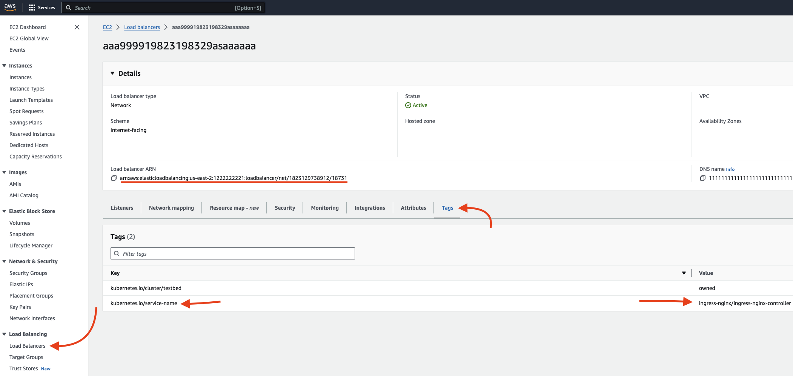

# AWS

```yaml
networking:
  aws:
    region: us-east-2
    route53:
      hostedZoneId: Z08127934XGRFES81701
      hostedZoneName: mydomain.io
      loadBalancerArn: arn:aws:elasticloadbalancing:us-east-2:1222222221:loadbalancer/net/1823129738912/18731
    secretRef:
      name: aws-api-token
```
<sup>N.B. This is only the `networking` section of the Workspace custom resource definition. A complete [YAML sample is available](../../dev/samples/workspace.yaml) if you're curious as to how it looks like.</sup>

The AWS works seamlessly with your [EKS cluster](https://docs.aws.amazon.com/eks/latest/userguide/clusters.html). If you're looking at starting an EKS cluster and want to make sure it's configured properly for Sequencer, you can read more about [configuring your EKS cluster here](../managed/eks.md).

|Key|Type|Required|Description|
|:----|-|-|-|
|`region`|string|✅|The AWS region you want to use|
|`route53`|[Route53](#route53)|✅|Definition of all the information required to manage DNS records in Route 53|
|`secretRef`|[SecretRef](#credentials)|❌|If your EKS cluster is [configured correctly](../managed/eks.md), this field should not be needed as the operator can retrieve credentials implicitly. However, for testing purposes, it might be useful to manually provide the credentials|

## [SecretRef](../../api/v1alpha1/utils/reference.go)

A reference to an existing secret, the SecretRef has the following schema.

|Key|Type|Required|Description|
|:----|-|-|-|
|`name`|string|✅|The name of the secret you want to use|
|`namespace`|string|❌|The namespace where the secret lives. If no namespace is specified, it will use the Workspace's namespace (defaults to `sequencer-system`)|

&nbsp;

The Secret must contains the access key id and the secret access key as specified, the keys are case-sensitive.

|Key|Description|
|:----|-|
|`accessKeyID`|string|The Access Key ID|
|`secretAccessKey`|string|The Secret Access Key|


## [Route 53](../../api/v1alpha1/providers/aws.go)

All the information from AWS needed to dynamically create route in Route53 and point them to a Network Load Balancer(NLB) that is connected to an ingress controller.

|Key|Type|Required|Description|
|:----|-|-|-|
|`hostedZoneId`|string|✅|The AWS region you want to use|
|`hostedZoneName`|string|✅|The hostedZoneName, ie, the domain you registered with Route53|
|`loadBalancerArn`|string|✅|The Load Balancer ARN that connects to the ingress controller running in EKS|

### On the Load Balancer ARN

The ideal goal would be to have the ability, within the operator, to figure out the EC2 Load Balancer from within Kubernetes. However, ingress controller don't have much information about the underlying EC2 load balancer. For this reason, the load balancer ARN needs to be manually specified as part of the networking spec. It's possible that in the future, Sequencer will be able to figure out the Load Balancer resource from within Kubernetes.

To retrieve your Load Balancer's ARN, you can go to [AWS's load balancer's page](https://us-east-2.console.aws.amazon.com/ec2/home) and locate your ARN there.

