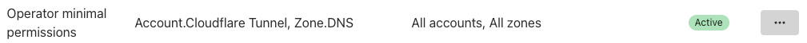

## Cloudflare
To use Cloudflare as a networking integration, you'll need to create an API token on their site and create a secret in your Kubernetes cluster. Unless the namespace is specified like the example above, the operator will expect the secret to live in the **same namespace as the one you used to deploy the Workspace**.

&nbsp;

### API Token

The API Token can be created by going to your [Cloudflare's profile page](https://dash.cloudflare.com/profile/api-tokens). Create a new token that will include the two permissions:

1. `Zone.DNS` for `All Zones`
2. `Account.Cloudflare Tunnel` for `All Account`

> 

It's possible to narrow down the zones and accounts to the specific one you want to use, but this is an exercise to the user. Once the API Token is created, you'll need to add it to the cluster, using the secret's name `cloudflare-api-token` as defined in the example above.

```sh
kubectl create secret generic cloudflare-api-token \
  --from-literal=accessToken=$(MY_CLOUDFLARE_API_TOKEN) \
  --namespace sequencer-system
```

&nbsp;

### Account IDs


