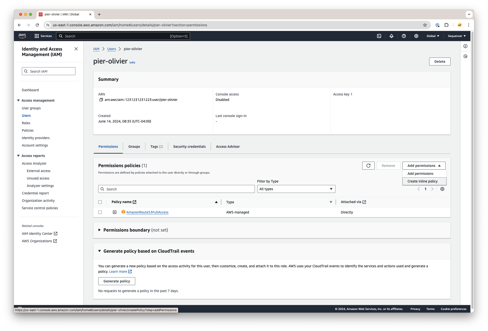
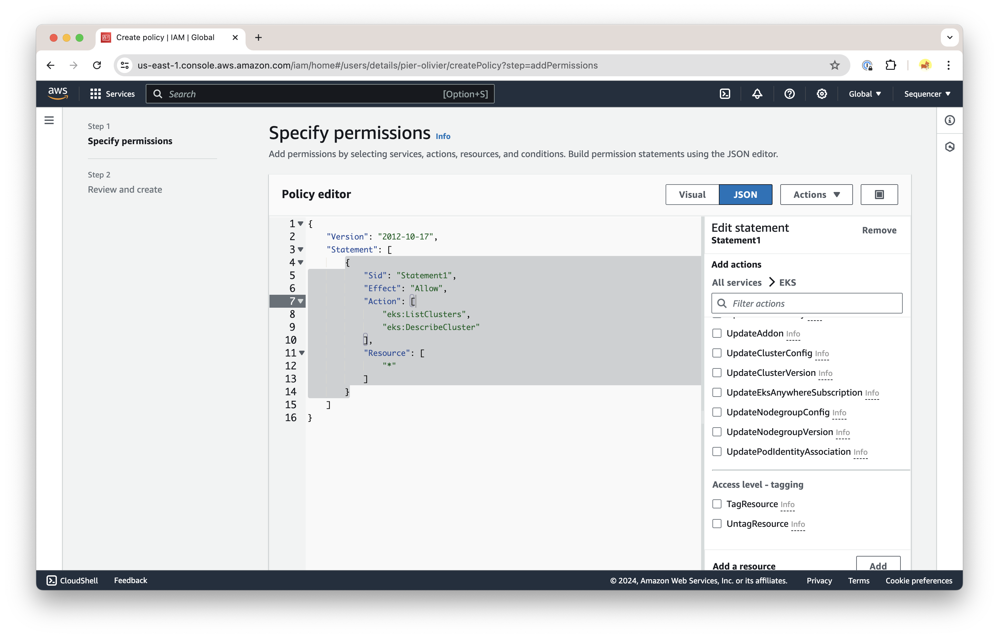
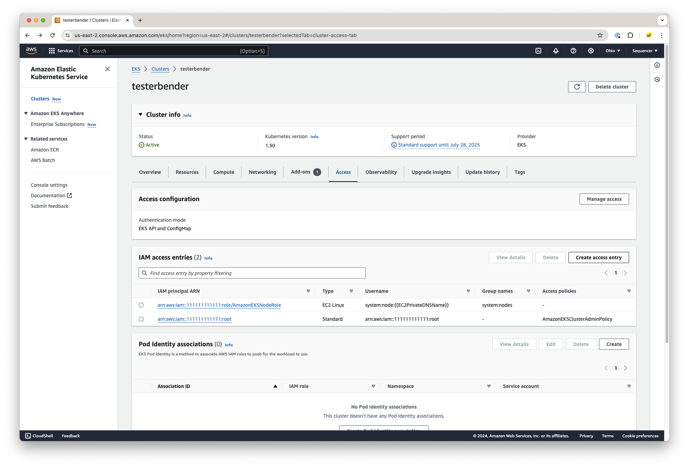
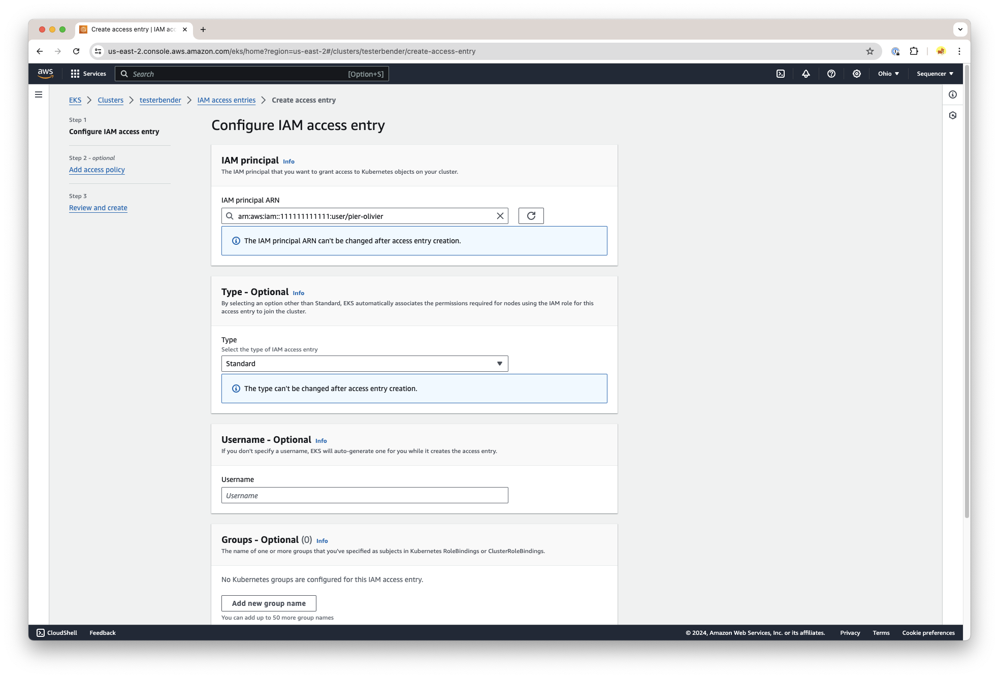

# Configure EKS for Sequencer

This guide assumes you have an EKS cluster already running in your account. That cluster should also have a node group (ec2 instances) running. The guide here is to help you get everything up and running within EKS.

## Permissions

Sequencer needs to have a few, but specific permission settings in order to be installed, and to run. The following steps are mutually exclusive, which means that after you've installed the operator, you can revert the changes you made in the installation section if you feel like it.

### For the installation

To install Sequencer, you'll need to apply the Helm chart and it will require you to use a user/role that has a few unique permissions. Below you'll see a list of screenshot that might give you a better idea of what you have to do to have the right credentials.

*This guide here will focus on a user, it will not create a role, and will not abstract some of the concept on AWS. The goal here is to get you up and running, while the explanation below are user-centric, you can absolutely use some of the concept here and abstract them as roles/user groups.*

The permissions required are split between AWS-level permissions and [Kubernetes' RBAC](https://kubernetes.io/docs/reference/access-authn-authz/rbac/). The AWS-level permissions are required to easily generate a `kubeconfig` for you to connect to your cluster to install the Helm chart. The RBAC permissions (through access policies), are needed so your user can deploy [Custom Resource Definitions](https://kubernetes.io/docs/concepts/extend-kubernetes/api-extension/custom-resources/#customresourcedefinitions) to Kubernetes.

Before you can proceed, this guide assumes you have the [CLI](https://aws.amazon.com/cli/) installed on your machine and it's logged in.. Throughout this guide, the user `pier-olivier` will be used, but you should see this as a placeholder to your own.

First, you'll need to create a policy with the following actions which will allow you to create a valid `kubeconfig`. You'll need to do this because, as of this writing, AWS doesn't have a managed policy that includes these.

&nbsp;

|Name|Description|
|-|-|
|eks:ListClusters|List the clusters available on your account|
|eks:DescribeCluster|Describe a cluster's configuration|

The following screenshot shows you a step by step to get those permissions assigned to your user. Start by accessing the user's page:


Then add the permissions described above to the inline policy


Name your policy, the name is only useful to have an overview of all the policies in the User's page. Also, confirm the policies you added and make sure there's no mistake


Once those steps are done and succesful, you should be able to create a `kubeconfig` file at `~/.kube/aws-config`
```sh
aws eks update-kubeconfig --region ${YOUR_REGION} --name ${YOUR_CLUSTER_NAME} --kubeconfig ~/.kube/aws.config  
```

You should know be able to query your cluster
```sh
kubectl get pods -A --kubeconfig ~/.kube/aws.config
```

We're half way done! Now, you'll need to add your user to EKS' access entries. Create a new access entry


The IAM Principal ARN needs to be your user. You should be able to see the ARN of your user by opening the dropdown


Clicking on Next, you will be asked to choose a policy you want to attach to the user. Select `AmazonEKSClusterAdminPolicy`


After creating the access policy, you'll be redirected to the access policy tab in the EKS dashboard. You should see your user with the right policies listed there as shown here


You should now be able to install the operator using the kubeconfig you created earlier

```sh
helm install sequencer https://github.com/pier-oliviert/sequencer/releases/download/v0.1/sequencer-0.1.0.tgz \
  --namespace sequencer-system \
  --create-namespace \
  --kubeconfig ~/.kube/aws.config
```

## DNS Service Account Permissions

The cluster needs to be configured with the OIDC provider following the guide here: https://docs.aws.amazon.com/eks/latest/userguide/enable-iam-roles-for-service-accounts.html
