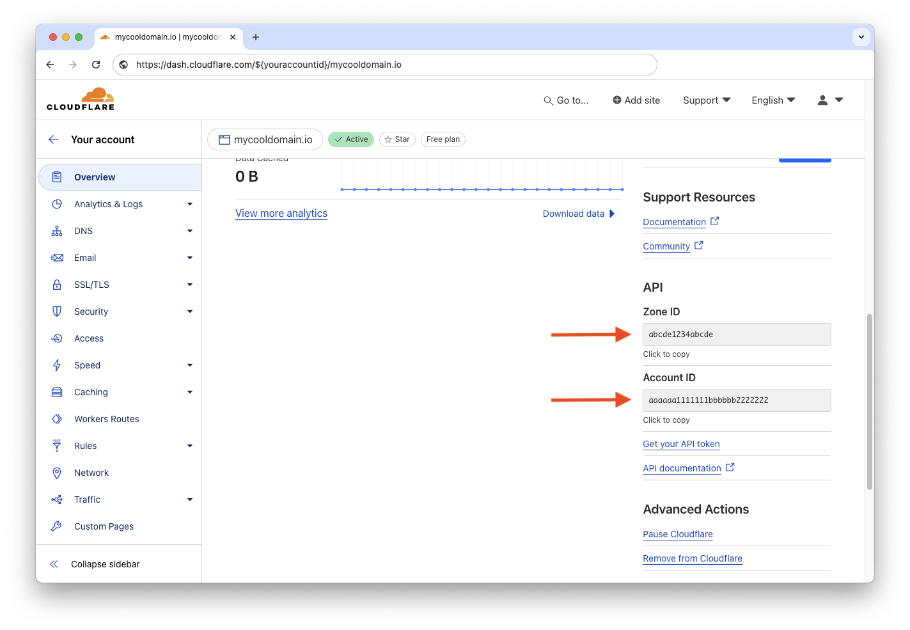

# Cloudflare

```yaml
networking:
  tunnel:
    cloudflare:
      secretKeyRef:
        namespace: default
        name: cloudflare-api-token
        key: accessToken
      connector: cloudflared
      accountId: 887766
      route:
        component: clickit
        network: httpserver
```
<sup>N.B. This is only the `networking` section of the Workspace custom resource definition. A complete [YAML sample is available](../../dev/samples/workspace.yaml) if you're curious as to how it looks like.</sup>

If you're just getting started with Sequencer, [Cloudflare Tunnel](https://www.cloudflare.com/products/tunnel/) can be a great option to [try out the operator](../../GET_STARTED.md). 

## Schema

|Key|Type|Required|Description|
|:----|-|-|-|
|`secretKeyRef`|[SecretKeyRef](#secretkeyref)|✅|Reference to the secret for the [API Token](#configure-cloudflare)|
|`connector`|✅|Connector to use, only supported value now is `cloudflared`|
|`accountId`|✅|The Zone ID for the zone Name, as described [here](#account-ids)|
|`route.component`|✅|The name of the component to connect to the tunnel|
|`route.network`|✅|The name of the network, within the component to connect to the tunnel|

The Route needs to specify the component and the network to associate with the tunnel. In the example above, it points to the `clickit` component and the `httpserver` network as defined in the [Workspace spec](../specs/workspace.md).

The tunnel can only create one route and shouldn't be used for complex network structure. It should only be used for **testing** purposes.

### SecretKeyRef
|Name|Required|Description|
|:----|-|-|
|`name`|✅|Name of the secret, in the same namespace where Sequencer runs, eg. sequencer-system|
|`key`|✅|The key in the secret that holds the API Token.|

If you don't already have an API token configured for Sequencer to use, you can get one [following these steps](#configure-cloudflare).

&nbsp;

## Configure Cloudflare
To use Cloudflare as a networking integration, you'll need to create an API token on their site and create a secret in your Kubernetes cluster. Unless the namespace is specified like the example above, the operator will expect the secret to live in the **same namespace as the one you used to deploy the Workspace**.

&nbsp;

### API Token

The API Token can be created by going to your [Cloudflare's profile page](https://dash.cloudflare.com/profile/api-tokens). Create a new token that will include the two permissions:

1. `Zone.DNS` for `All Zones`
2. `Account.Cloudflare Tunnel` for `All Account`

> 

It's possible to narrow down the zones and accounts to the specific one you want to use, but this is an exercise to the user. Once the API Token is created, you'll need to add it to the cluster, using the secret's name `cloudflare-api-token` as defined in the example above.

```sh
kubectl create secret generic cloudflare-api-token \
  --from-literal=accessToken=$(MY_CLOUDFLARE_API_TOKEN) \
  --namespace sequencer-system
```

&nbsp;

### Account IDs

